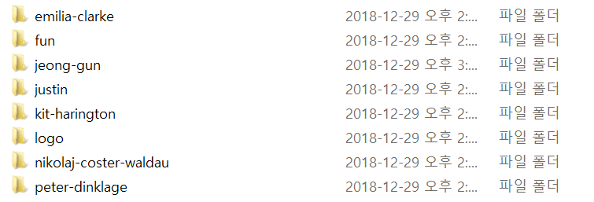
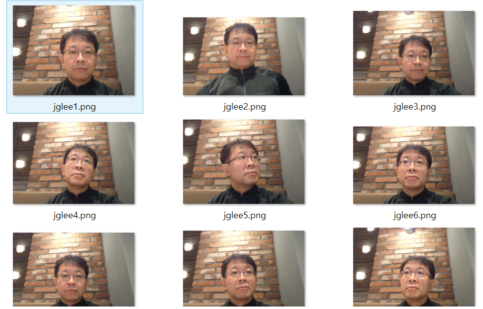
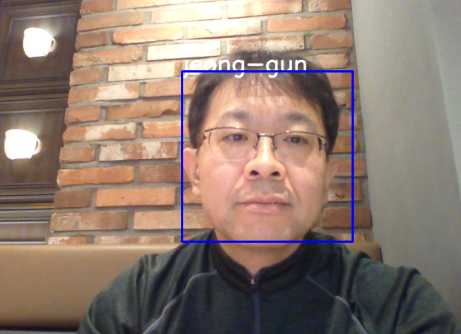
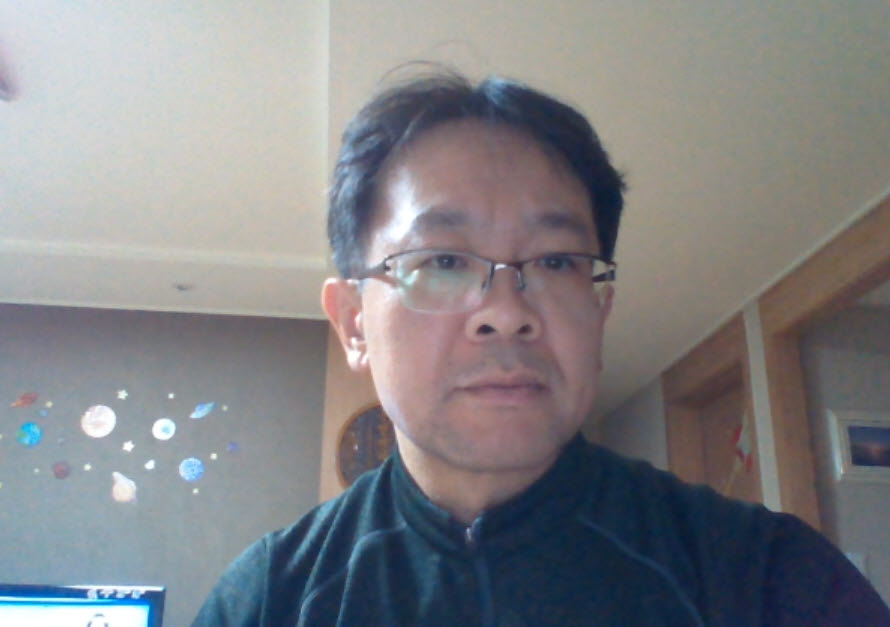
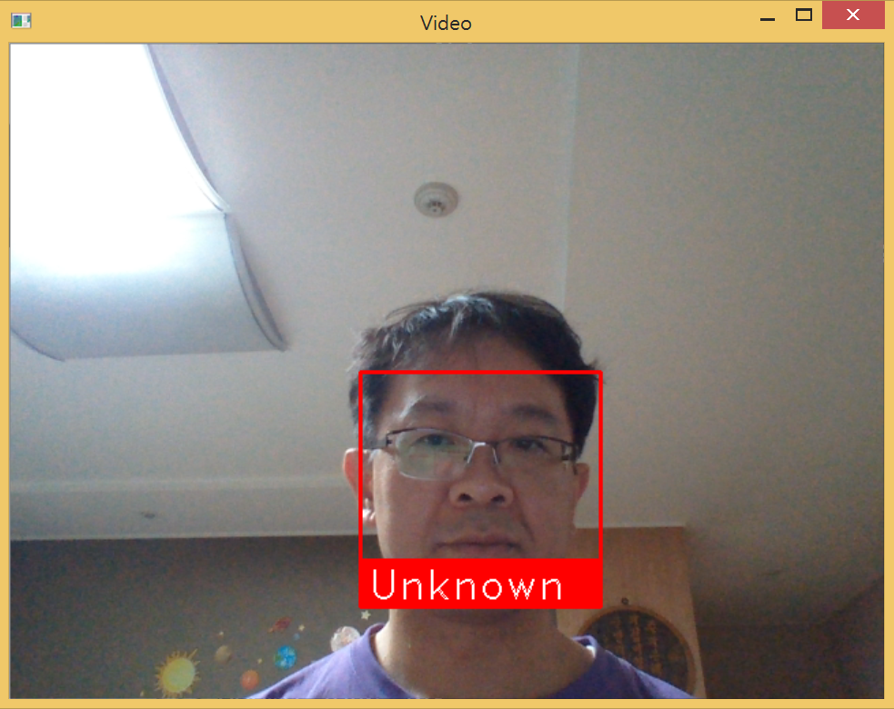
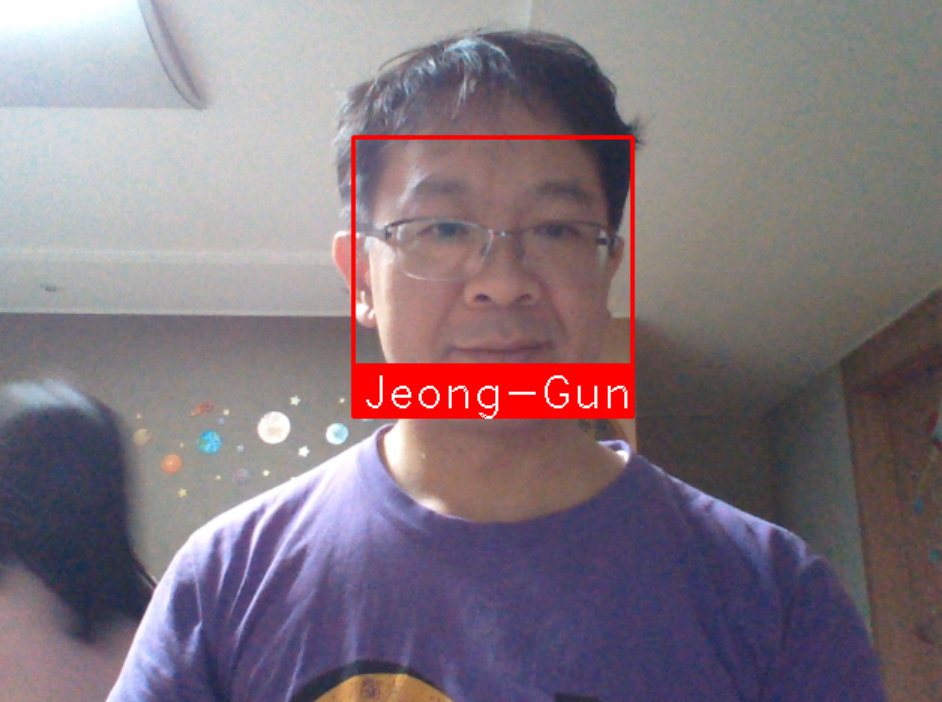
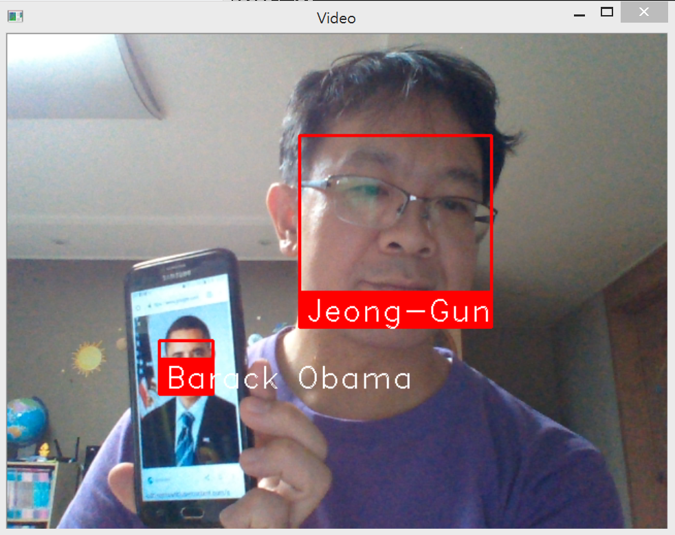

# faceid
Start: 29 Dec. 2018
UPDATE: 1 Jan. 2018: face recognition library 설치 및 test / 분석

## Face Detection and Identification for Smart Toy: Geomex Soft.

#### Jeong-Gun Lee
> School of Software, Hallym University
> Email : jeonggun.lee@gmail.com

*  *  *

인지형 스마트 토이를 만들기 위한 가장 기본적인 기능으로, 현재 토이 앞에 위치한 사람을 인식하는 것이 필요하다.
카메라를 통한 사람의 인식은 크게 두개의 스텝으로 이루어 진다.

   1. **Face Recognition**: 영상으로 부터 사람의 얼굴 부분을 검출
   2. **Face Identification**: 검출된 얼굴을 기존 학습된 데이터를 통해 ```누구```인지 파악

이러한 작업을 진행함에 있어 동영상 강의 및 코드를 오픈한 것이 있어 이를 기반으로 작업을 진행하고자 한다.

본 문서는 ```https://github.com/codingforentrepreneurs/OpenCV-Python-Series```에 기술된 코드에 대한 분석 및 응용에 대한 문서이다 [1].

*  *  *
 OpenCV를 처음 사용하는 사람으로 기존 프로그래밍 지식에 근거하여 분석을 진행한다.
 일차적으로 OpenCV를 설치하기 위하여 다음 명령어를 사용하였다 [2].
 
```
run pip install opencv-python-headless if you need only main modules
run pip install opencv-contrib-python-headless if you need both main and contrib modules 
```

이후, 해당 코드를 Github로 부터 cloning 한다.

```
git clone https://github.com/codingforentrepreneurs/OpenCV-Python-Series

Cloning into 'OpenCV-Python-Series'...
remote: Enumerating objects: 1, done.
remote: Counting objects: 100% (1/1), done.
remote: Total 216 (delta 0), reused 0 (delta 0), pack-reused 215
Receiving objects: 100% (216/216), 17.13 MiB | 2.90 MiB/s, done.
Resolving deltas: 100% (91/91), done.
```

cloning한 코드에서 가장 기본적인 코드인 ```base.py```의 코드를 살펴보면 아래와 같다.

```python
import numpy as np
import cv2

cap = cv2.VideoCapture(0)
# [3] 참조
# cap 이 정상적으로 open이 되었는지 확인하기 위해서 cap.isOpen() 으로 확인가능
# cap.get(prodId)/cap.set(propId, value)을 통해서 속성 변경이 가능.
# 3은 width, 4는 heigh
print 'width: {0}, height: {1}'.format(cap.get(3),cap.get(4))
cap.set(3,320)
cap.set(4,240)


while(True):
    # Capture frame-by-frame
    # ret : frame capture결과(boolean)
    # frame : Capture한 frame
    ret, frame = cap.read()
    
    if (ret):
        # Display the resulting frame
        cv2.imshow('frame',frame)
        # Grayscale을 원할 경우 image를 Grayscale로 Convert함.
        gray = cv2.cvtColor(frame, cv2.COLOR_BGR2GRAY)
        cv2.imshow('frame', gray)
        
        ## waitKey : 20 ms 대기, 0이라면 무한 대기
        if cv2.waitKey(20) & 0xFF == ord('q'):   # q 버튼이 눌리면 프로그램 while 
            break

# When everything done, release the capture
cap.release()
cv2.destroyAllWindows()
```

일단 영상을 쉽게 받아들이고 간단히 처리할 수 있는 느낌이여서 재밌다. ^^

*  *  *
다음은 영상으로 부터 얼굴 부분을 검출한 후에 ```검출된 얼굴 이미지를 이용하여 이후 절차인 인식을 위하여 학습```을 진행하는 코드를 보여준다 (```faces-train.py```).

```python
import cv2
import numpy as np
import os              # os 모듈은 Operating System의 약자로서 운영체제에서 제공되는 여러 기능을 파이썬에서 수행할 수 있게 해줌
from PIL import Image  # Pillow는 PIL(Python Image Library)를 계승한 라이브러리로, PIL 대신 사용하는 파이썬 라이브러리이다
import pickle          # pickle 모듈은 파이썬 객체를 파일로 저장하고 로딩하는 기능을 제공

BASE_DIR = os.path.dirname(os.path.abspath(__file__))
image_dir = os.path.join(BASE_DIR, "images")

face_cascade = cv2.CascadeClassifier('cascades/data/haarcascade_frontalface_alt2.xml')
recognizer = cv2.face.LBPHFaceRecognizer_create()

# 얼굴 데이터 획득을 위한 자료 구조
current_id = 0   # 구분할 얼굴의 수
label_ids = {}   # 라벨 리스트
x_train = []     # 얼굴 데이터 리스트
y_labels = []    # 해당 라벨 리스트

# 메인 for loop: 얼굴 사진을 추출하고 학습을 위한 데이터를 준비하는 단계
for root, dirs, files in os.walk(image_dir):
    for file in files:
	if file.endswith("png") or file.endswith("jpg"):
	    path = os.path.join(root, file)
	    label = os.path.basename(root).replace(" ", "-").lower()
	    #print(label, path)
	    if not label in label_ids:
		label_ids[label] = current_id
		current_id += 1
	    id_ = label_ids[label]
	    #print(label_ids)
	    #y_labels.append(label) # some number
	    #x_train.append(path) # verify this image, turn into a NUMPY arrray, GRAY
	    pil_image = Image.open(path).convert("L") # grayscale
	    size = (550, 550)
	    final_image = pil_image.resize(size, Image.ANTIALIAS)
	    image_array = np.array(final_image, "uint8")
	    #print(image_array)
	    faces = face_cascade.detectMultiScale(image_array, scaleFactor=1.5, minNeighbors=5)

	    for (x,y,w,h) in faces:
		roi = image_array[y:y+h, x:x+w]
		x_train.append(roi)
		y_labels.append(id_)

#print(y_labels)
#print(x_train)

with open("pickles/face-labels.pickle", 'wb') as f:
    pickle.dump(label_ids, f)

recognizer.train(x_train, np.array(y_labels))
recognizer.save("recognizers/face-trainner.yml")
```

이후에 얼굴 데이터베이스로 사용되는 디렉토리에 ```jeong-gun``` 디렉토리를 만들고 나의 사진을 9장 찍어서 넣었다.






다음은 메인 코드의 for 문이 완료된 후에 다음과 같은 프린트 문을 통하여 ```y_labels``` 및 ```labels_ids```가 어떤 데이터를 포함하고 있는지 알 수 있다.

```
print(y_labels)
print(label_ids)
```

위의 프린트 문을 통하여 나온 내용은 다음과 같다.
```
C:\Users\eulia\Python\OpenCV-Python-Series\src>python faces-train.py
[0, 0, 2, 2, 2, 3, 3, 3, 3, 3, 4, 4, 4, 4, 4, 4, 6, 6, 6, 6]
{'emilia-clarke': 0, 'fun': 1, 'jeong-gun': 2, 'justin': 3, 'kit-harington': 4, 'logo': 5, 'nikolaj-coster-waldau': 6, 'peter-dinklage': 7}
```
전체 7개의 디렉토리중에 얼굴이 검출된 디렉토리는 0, 2, 3, 4, 6, 7로 6개의 디렉토리에서 검출되었으며, 1 (fun)과 5 (logo)에 해당하는 디렉토리에서는 얼굴이 검출되지 않았음을 알 수 있다 (실제 fun과 log 디렉토리는 얼굴 사진을 포함하고 있지 않다).

더불어, 나의 경우 9장의 사진을 ```jeong-gun``` 디렉토리에 넣었지만, 3장에서만 얼굴을 검출하였고, 이 3장만 학습에 사용되었음을 알 수 있다.

*  *  *

최종적으로 학습된 모델에 근거하여 영상으로 부터 ```검출된 얼굴에 대한 identification을 진행```한다 ((```faces.py```)).

```python
import numpy as np
import cv2
import pickle

# 영상에서 "얼굴" 부분을 검출 하기 위한 Classifier 및 학습 데이터 로드
face_cascade = cv2.CascadeClassifier('cascades/data/haarcascade_frontalface_alt2.xml')
# "눈" 부분을 검출하기 위한 Classifier 및 학습 데이터 로드
eye_cascade = cv2.CascadeClassifier('cascades/data/haarcascade_eye.xml')
# "미소" 특성을 검출 하기 위한 Classifier 및 학습 데이터 로드
smile_cascade = cv2.CascadeClassifier('cascades/data/haarcascade_smile.xml')
# 위의 분류기에서 눈인식 및 미소인식은 사용되지 않는다. 
# 다만, 미소 인식기는 향후 인식한 사람의 기분등에 대한 데이터를 모아 인식한 사람의 속성으로 사용될 수 있을 것이다.

recognizer = cv2.face.LBPHFaceRecognizer_create()
# recognizer가 "face-trainner.yml"을 읽는다.
# "face-trainner.yml은 응용 엔지니어가 갖고 있는 영상 이미지 데이터에 근거하여 "faces-train.py"를 학습한 데이터이다.
# "face_cascade"가 얼굴을 검출하면 검출된 얼굴을 기존에 학습한 데이터와 연계하여 matching되는 얼굴을 찾게 된다.
recognizer.read("./recognizers/face-trainner.yml")

labels = {"person_name": 1}
with open("pickles/face-labels.pickle", 'rb') as f:
	og_labels = pickle.load(f)
	labels = {v:k for k,v in og_labels.items()}

# 영상 취득 시작
cap = cv2.VideoCapture(0)

while(True):
    # Capture frame-by-frame
    ret, frame = cap.read()
    gray  = cv2.cvtColor(frame, cv2.COLOR_BGR2GRAY)     # Grayscale로 변환
    
    # 영상으로 부터 얼굴 부분을 검출. [7] 참조
    # 얼굴부분이라고 인식된 위치 박스들의 리스트를 반환한다.
    faces = face_cascade.detectMultiScale(gray, scaleFactor=1.5, minNeighbors=5)
    
    # 얼굴 부분으로 인식된 각 위치 정보들에 대해서 for loop 진행
    for (x, y, w, h) in faces:
    	#print(x,y,w,h)
	# 관심 영역 추출 (grayscale 이미지, color 이미지) 두개를 뽑아냄.
    	roi_gray = gray[y:y+h, x:x+w] #(ycord_start, ycord_end)
    	roi_color = frame[y:y+h, x:x+w]

    	# recognize? deep learned model predict keras tensorflow pytorch scikit learn
	# 흑백 얼굴 이미지를 recognizer의 입력으로 주고, recognizer는 인식된 id 와 인식 신뢰도를 반환한다.
    	id_, conf = recognizer.predict(roi_gray)
	
	# 신뢰도가 4보다 크거나 같고 85보다 작거나 같을때,  인식된 이름 쓰기
	# 신뢰도는 작은 값일 수록 좋은 추측임을 의미한다.
	# 신뢰도는 distance metric으로 계산.
    	if conf>=4 and conf <= 85:
    	    #print(5: #id_)
    	    #print(labels[id_])
    	    font = cv2.FONT_HERSHEY_SIMPLEX
    	    name = labels[id_]
    	    color = (255, 255, 255)
    	    stroke = 2
    	    cv2.putText(frame, name, (x,y), font, 1, color, stroke, cv2.LINE_AA)

        # 검출된 영역을 7.png 이름으로 저장
    	img_item = "7.png"
    	cv2.imwrite(img_item, roi_color)

	# 박스 그리기
    	color = (255, 0, 0) #BGR 0-255 
    	stroke = 2
    	end_cord_x = x + w
    	end_cord_y = y + h
    	cv2.rectangle(frame, (x, y), (end_cord_x, end_cord_y), color, stroke)
    	#subitems = smile_cascade.detectMultiScale(roi_gray)
    	#for (ex,ey,ew,eh) in subitems:
    	#	cv2.rectangle(roi_color,(ex,ey),(ex+ew,ey+eh),(0,255,0),2)
	
    # Display the resulting frame
    cv2.imshow('frame',frame)
    if cv2.waitKey(20) & 0xFF == ord('q'):
        break

# When everything done, release the capture
cap.release()
cv2.destroyAllWindows()
```




**문제점**

영상에서 얼굴 부분을 찾아내는 기능이 매우 제한적이다. 얼굴의 정면만을 인식하기 때문에 다양한 방향에서 나타나는 얼굴을 뽑아내기가 어렵다. 이러한 face recognition의 제약으로 실제 학습에 사용되는 얼굴 이미지도 상당부분 정면 사진만을 사용하게 되며 이는 실제 적용시에 문제가 될 것으로 생각된다.

이를 위하여 보다 다양한 방향에서의 얼굴을 뽑아 낼 수 있는 face recognition을 할 수 있는 소프트웨어가 필요하다.

*  *  *

## Face Recognition library 활용.

[Face Recognition](https://pypi.org/project/face_recognition/) 에 대해서 살펴보고 활용하기 [8].
>Recognize and manipulate faces from Python or from the command line with
>the world’s simplest face recognition library.
>Built using dlib’s state-of-the-art face recognition
>built with deep learning. The model has an accuracy of 99.38% on the
>Labeled Faces in the Wild benchmark.

```face recognition``` library [8, 10]를 사용하고자 할때, 필요한 경우 cmake, dlib [12] 등 설치가 필요하다.
dlib를 설치할때, 윈도우즈에서 Visual Stdio 버전 등의 mismatch 문제로 설치상에 어려움이 있었다.
이 경우에는 Visual Stdio를 Update하여 최신 버전의 개발 환경으로 만든 후 dlib를 설치하면 올바로 설치된다.

```
C:\Users\eulia\Python>pip install dlib
Collecting dlib
  Using cached https://files.pythonhosted.org/packages/35/8d/e4ddf60452e2fb1ce31
64f774e68968b3f110f1cb4cd353235d56875799e/dlib-19.16.0.tar.gz
Installing collected packages: dlib
  Running setup.py install for dlib ... done
Successfully installed dlib-19.16.0

C:\Users\eulia\Python>pip install face-recognition
Collecting face-recognition
  Using cached https://files.pythonhosted.org/packages/3f/ed/ad9a28042f373d4633f
c8b49109b623597d6f193d3bbbef7780a5ee8eef2/face_recognition-1.2.3-py2.py3-none-an
y.whl
Collecting Click>=6.0 (from face-recognition)
  Using cached https://files.pythonhosted.org/packages/fa/37/45185cb5abbc30d7257
104c434fe0b07e5a195a6847506c074527aa599ec/Click-7.0-py2.py3-none-any.whl
Requirement already satisfied: dlib>=19.7 in c:\users\eulia\appdata\local\progra
ms\python\python37-32\lib\site-packages (from face-recognition) (19.16.0)
Collecting face-recognition-models>=0.3.0 (from face-recognition)
  Using cached https://files.pythonhosted.org/packages/cf/3b/4fd8c534f6c0d1b80ce
0973d01331525538045084c73c153ee6df20224cf/face_recognition_models-0.3.0.tar.gz
Requirement already satisfied: Pillow in c:\users\eulia\appdata\local\programs\p
ython\python37-32\lib\site-packages (from face-recognition) (5.3.0)
Requirement already satisfied: numpy in c:\users\eulia\appdata\local\programs\py
thon\python37-32\lib\site-packages (from face-recognition) (1.15.3)
...
...
...
```

다음은 학습에 사용한 사진이다.


*  *  *
다음은 ```학습전```과 ```학습후``` 카메라로 부터 받은 영상을 인식한 결과이다.

```학습전```



```학습후```


오바마 대통령과 나! ^^



*  *  *

face recognition lib를 사용한 인식은 상대적으로 매우 좋은 성능을 보여주는 것 같다. 아직 많은 수의 사람에 대한 인식을 테스트해보지는 못했지만, 이전에 사용했던 ```cv2.face.LBPHFaceRecognizer```에 비해 훨씬 잘 작동하였다.

face recognition lib은 face_encoding이란 함수를 사용하는데, face encoding에서는 함수 내부적으로 머신러닝의 기술이 사용되는 듯하다 [14].

>딥 컨볼루션 신경망(Deep Convolutional Neural Network)을 훈련시키는 것입니다. 그러나 우리가 마지막으로 했던 것처럼 사진에서 객체를 인식하도록 신경망을 훈련시키는 대신, 각 얼굴에 대해 128개의 측정값을 생성하도록 훈련시킬 것입니다.
>
>훈련 과정은 3 개의 얼굴 이미지를 차례 대로 확인하는 것입니다.
>
>1. 훈령용 아는 사람의 얼굴 사진 적재(load)
>
>2. 동일한 아는 사람의 다른 사진 적재
>
>3. 전혀 다른 사람의 사진 적재
>
>그리고 알고리즘은 세 개의 이미지 각각에 대해 현재 생성하고 있는 측정값을 확인합니다. 그런 다음에, #1 과 #2 이미지에 대해 생성한 측정값은 서로 좀더 >가깝게 하고 #2와 #3의 측정값은 좀더 멀어지도록 신경망을 조금 조정합니다
>
> [링크: **Triplet Training** ](https://medium.com/@jongdae.lim/%EA%B8%B0%EA%B3%84-%ED%95%99%EC%8A%B5-machine-learning-%EC%9D%80-%EC%A6%90%EA%B2%81%EB%8B%A4-part-4-63ed781eee3c)
>

*  *  *

## [CODE]

```python
import face_recognition
import cv2

# This is a super simple (but slow) example of running face recognition on live video from your webcam.
# There's a second example that's a little more complicated but runs faster.

# PLEASE NOTE: This example requires OpenCV (the `cv2` library) to be installed only to read from your webcam.
# OpenCV is *not* required to use the face_recognition library. It's only required if you want to run this
# specific demo. If you have trouble installing it, try any of the other demos that don't require it instead.

# Get a reference to webcam #0 (the default one)
video_capture = cv2.VideoCapture(0)

# Load a sample picture and learn how to recognize it.
obama_image = face_recognition.load_image_file("obama.jpg")
obama_face_encoding = face_recognition.face_encodings(obama_image)[0]

# Load a second sample picture and learn how to recognize it.
biden_image = face_recognition.load_image_file("biden.jpg")
biden_face_encoding = face_recognition.face_encodings(biden_image)[0]

# Load a second sample picture and learn how to recognize it.
jeonggun_image = face_recognition.load_image_file("jeonggun.jpg")
jeonggun_face_encoding = face_recognition.face_encodings(jeonggun_image)[0]

chaeyoung_image = face_recognition.load_image_file("chaeyoung.jpg")
chaeyoung_face_encoding = face_recognition.face_encodings(chaeyoung_image)[0]

# Create arrays of known face encodings and their names
known_face_encodings = [
    obama_face_encoding,
    biden_face_encoding,
    jeonggun_face_encoding,
    chaeyoung_face_encoding
]
known_face_names = [
    "Barack Obama",
    "Joe Biden",
    "Jeong-Gun",
    "Chae-Young"
]

while True:
    # Grab a single frame of video
    ret, frame = video_capture.read()

    # Convert the image from BGR color (which OpenCV uses) to RGB color (which face_recognition uses)
    rgb_frame = frame[:, :, ::-1]

    # Find all the faces and face enqcodings in the frame of video
    face_locations = face_recognition.face_locations(rgb_frame)
    face_encodings = face_recognition.face_encodings(rgb_frame, face_locations)

    # Loop through each face in this frame of video
    for (top, right, bottom, left), face_encoding in zip(face_locations, face_encodings):
        # See if the face is a match for the known face(s)
        matches = face_recognition.compare_faces(known_face_encodings, face_encoding)

        name = "Unknown"

        # If a match was found in known_face_encodings, just use the first one.
        if True in matches:
            first_match_index = matches.index(True)
            name = known_face_names[first_match_index]

        # Draw a box around the face
        cv2.rectangle(frame, (left, top), (right, bottom), (0, 0, 255), 2)

        # Draw a label with a name below the face
        cv2.rectangle(frame, (left, bottom - 35), (right, bottom), (0, 0, 255), cv2.FILLED)
        font = cv2.FONT_HERSHEY_DUPLEX
        cv2.putText(frame, name, (left + 6, bottom - 6), font, 1.0, (255, 255, 255), 1)

    # Display the resulting image
    cv2.imshow('Video', frame)

    # Hit 'q' on the keyboard to quit!
    if cv2.waitKey(1) & 0xFF == ord('q'):
        break

# Release handle to the webcam
video_capture.release()
cv2.destroyAllWindows()

```

# References

1. [OpenCV Python TUTORIAL #4 for Face Recognition and Identification](https://www.youtube.com/watch?v=PmZ29Vta7Vc)
   - [Github](https://github.com/jeonggunlee/OpenCV-Python-Series)
2. https://pypi.org/project/opencv-python/
3. https://opencv-python.readthedocs.io/en/latest/doc/02.videoStart/videoStart.html
4. [Raspberry Pi Face Recognition](https://www.pyimagesearch.com/2018/06/25/raspberry-pi-face-recognition/)
5. [음성인식: 라즈베리파이+Google Assist](https://blog.naver.com/renucs/221297676020)
6. [라즈베리파이에 구글 음성인식 사용하기 (최신 샘플코드 + 한국어)](http://diy-project.tistory.com/91)
7. [OBJECT DETECTION : FACE DETECTION USING HAAR CASCADE CLASSFIERS](https://www.bogotobogo.com/python/OpenCV_Python/python_opencv3_Image_Object_Detection_Face_Detection_Haar_Cascade_Classifiers.php)
8. [Face Recognition](https://github.com/ageitgey/face_recognition)
9. [이미지 Detection 문제와 딥러닝: YOLOv2로 얼굴인식하기](http://research.sualab.com/machine-learning/computer-vision/2018/05/14/image-detection-deep-learning.html)
   - [Github](https://github.com/sualab/object-detection-yolov2-tf)
10. [OpenCV Face Recognition](https://www.pyimagesearch.com/2018/09/24/opencv-face-recognition/)
11. [OpenFace](https://cmusatyalab.github.io/openface/)
12. [Dlib: Deep Learning Library](http://dlib.net)
13. [Face Clustering](https://ukayzm.github.io/face-clustering/): 모르는 사람 구분
14. [딥러닝(Deep Learning)을 사용한 최신 얼굴 인식(Face Recognition)](https://medium.com/@jongdae.lim/%EA%B8%B0%EA%B3%84-%ED%95%99%EC%8A%B5-machine-learning-%EC%9D%80-%EC%A6%90%EA%B2%81%EB%8B%A4-part-4-63ed781eee3c): face encoding에 대한 
